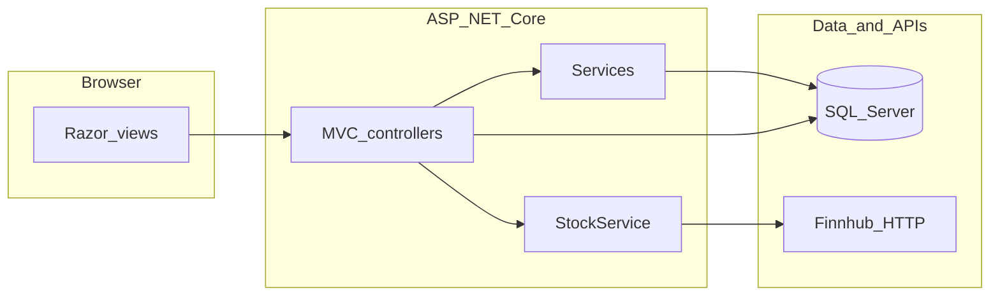

# InvestmentApp

InvestmentApp is a **group-built**, **demo-oriented** ASP.NET Core web application that simulates basic banking and self-directed investing. Users can sign in, manage a simple chequing or savings account, maintain one or more stock portfolios (self-directed or managed), search symbols, buy and sell holdings using live-style quotes, and browse short price-history charts. An optional admin area lists registered users for oversight-style workflows.

This repository is **course or prototype quality**: authentication and secrets handling are intentionally simple, and the product is **not** intended for production use.

---

## Features

- **User authentication**: Sign up, log in, and log out with cookie-based sessions (default landing route is the login page).
- **User profile**: View, edit, or delete your profile while signed in.
- **Accounts (simulated)**: Open a chequing or savings account, adjust balance, add funds, or remove the account. Savings balances can show a simple illustrative interest calculation.
- **Portfolios**: Create named portfolios as **self-directed** or **managed** (only one managed portfolio per user). Deposit or withdraw from chequing from the portfolio area, edit portfolio type, or delete a portfolio and its holdings.
- **Managed portfolios**: On creation, the app can seed starter holdings (for example MSFT, GOOG, PLTR) when matching rows exist in the stock table, using current quote data where available.
- **Stocks and trading**: Search symbols via Finnhub, persist discovered symbols, refresh prices from the API, buy from search or from the portfolio view, and sell back to chequing with quantity checks.
- **Charts**: Recent daily candle data can be loaded for a symbol to support a compact chart view in the UI.
- **Admin**: Separate session-based admin login and a dashboard listing users (demo credentials are defined in code for convenience).

Some layers are still thin or placeholders (for example a stub API controller and placeholder portfolio-service methods); see **Project layout** below.

---

## Tech stack

| Area | Technology |
|------|------------|
| Runtime | .NET 8 |
| Web framework | ASP.NET Core MVC |
| Data access | Entity Framework Core 8, SQL Server provider |
| Database | SQL Server (LocalDB connection string by default) |
| UI | Razor views, Bootstrap and jQuery (vendored under `wwwroot/lib`) |
| Market data | Finnhub REST API (quotes, search, daily candles) |
| Other | Newtonsoft.Json for candle JSON parsing |

---

## Prerequisites

- [.NET 8 SDK](https://dotnet.microsoft.com/download/dotnet/8.0)
- SQL Server **LocalDB** or another SQL Server instance you can point the connection string at

---

## Getting started

From the repository root (where `InvestmentApp.sln` lives):

```bash
dotnet restore
dotnet run --project InvestmentApp
```

Then open the app in a browser. Typical local URLs (see `InvestmentApp/Properties/launchSettings.json`) include:

- HTTPS: `https://localhost:7078`
- HTTP: `http://localhost:5062`

On first run, the database is created if missing and **seed data** is applied when there are no users yet: sample users **alice@mail.com** / **alice**, **bob@mail.com** / **bob**, and **charlie@mail.com** / **charlie**, each with a chequing balance and an initial self-directed portfolio, plus a few well-known tickers in the stock table.

---

## Configuration

### Database

In `InvestmentApp/appsettings.json`, set `ConnectionStrings:DefaultConnection` to your SQL Server instance. The default uses `(localdb)\MSSQLLocalDB` and database name `ProjectModels`.

### Finnhub API key

Market data requires a Finnhub API key under configuration key **`Finnhub:ApiKey`**.

**Do not commit real API keys** to public repositories. Prefer [User Secrets](https://learn.microsoft.com/aspnet/core/security/app-secrets) for local development:

```bash
cd InvestmentApp
dotnet user-secrets init
dotnet user-secrets set "Finnhub:ApiKey" "YOUR_KEY_HERE"
```

If a key was ever committed to git history, **rotate it** in the Finnhub dashboard and use the new value only in secrets or environment variables.

---

## Architecture (high level)



Controllers coordinate HTTP and views; scoped services (`AccountService`, `AdminService`, `ManagedPortfolioService`, etc.) and `StockService` encapsulate business rules and external HTTP calls. EF Core maps entities in `InvestmentApp/Models` to SQL Server.

---

## Project layout

```
FinancialApp/
├── InvestmentApp.sln
├── README.md
├── SQLQuery1.sql              # ad hoc SQL samples (accounts tables)
└── InvestmentApp/
    ├── Program.cs             # app startup, DI, middleware, DB seed
    ├── appsettings.json       # connection string, logging, Finnhub key placeholder
    ├── Controllers/           # MVC controllers (auth, stock, portfolio, account, admin, …)
    ├── Models/                # EF entities, DbContext, DbInitializer, StockService
    ├── Services/              # account, admin, managed portfolio, portfolio stubs
    ├── Views/                 # Razor pages per area
    ├── Migrations/            # EF Core migrations snapshot/history
    └── wwwroot/               # static assets; lib/ holds Bootstrap and jQuery
```

Module-level authorship notes appear in several source file headers (for example authentication, portfolio, stock, and account areas).

---

## Contributors

This project was developed **collaboratively as a group effort**. Contributors credited in the codebase include:

- **Keegan Erdis** — stock and market-data integration, database context and seeding, managed portfolio initialization, and related controller work.
- **Nathan Serrano** — authentication, user profile, and historical chart support alongside other UI touches.
- **Hanjia Li** — portfolio and account flows, admin session login, and supporting services.

If you extend the app, consider updating this section and the file-header comments so future readers know who owns which areas.

---

## Status and known limitations

The application is **unfinished** and will keep evolving. In particular, **Finnhub’s free tier enforces tight rate limits**: searching symbols, loading every holding’s live price, and opening charts each trigger HTTP calls, so during normal clicking around you can **run into throttling or empty responses** fairly quickly. That is expected with this architecture and pricing tier, not a one-off glitch. Mitigations for a future iteration might include caching, batching, backing off retries, or a paid data plan.

Other limitations worth keeping in mind:

- User passwords are stored and compared **in plain text** (suitable only for demos).
- Admin accounts are **hard-coded** for lab-style access.
- `PortfolioService` contains placeholder methods; `APIController` is minimal.

---

## License

No license file is included in this repository. Add one if you distribute or reuse the code outside your team or course.
